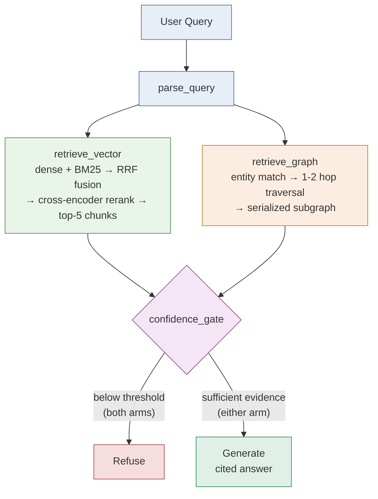

# GraphRAG for Organizational Knowledge (Week 2 Project)

Two retrieval arms — hybrid vector-RAG and GraphRAG — run over the same
corpus (the LangChain GitHub repo: PRs, issues, RFCs, module docs) and are
compared head-to-head on the same 10 queries, so the difference between
"semantic similarity" and "structured relationships" is measured, not just
asserted.

Status: fully implemented and working end-to-end — ingestion, both
retrieval arms, the confidence gate, generation, the LangGraph state
machine, and a chat UI. See **[docs/COMPARISON_ANALYSIS.md](docs/COMPARISON_ANALYSIS.md)**
for the head-to-head comparison summary, or
**[docs/EVAL_RESULTS.md](docs/EVAL_RESULTS.md)** for the full
investigation log (bugs found, root causes, every fix).

Full architecture, diagrams, and reasoning: **[Two Arms, One Corpus](docs/PLAN.md)**
(also published as an interactive artifact — see `docs/PLAN.md` for the link).

## Architecture



Both arms run in parallel on every query, wired through a LangGraph state
machine (`app/graph_flow.py`). A shared confidence gate — not the LLM —
decides whether to answer or refuse.

## One-liner

> My RAG app helps open-source contributors and maintainers answer "who
> worked on what, and what decisions were made and by whom" questions from
> the LangChain GitHub repo's contributors, PRs, issues, and RFCs, in a
> simple chat interface, with 90% faithfulness.

## Prerequisites

- Python 3.10+
- A GitHub personal access token (read-only, for pulling PRs/issues via API)
- An Anthropic API key (generation — Claude)
- Nothing else required by default: embeddings run locally
  (sentence-transformers, no API key) and the graph store is in-memory
  NetworkX (no server). Both are swappable — see `app/common/config.py`.

## Install & run

```bash
python3 -m venv .venv
source .venv/bin/activate   # on Windows: .venv\Scripts\activate
pip install -r requirements.txt
cp .env.example .env        # fill in GITHUB_TOKEN and ANTHROPIC_API_KEY
```

A pulled corpus is already committed under `data/corpus/raw/` so the app
works out of the box. Re-pull for fresher data (writes over the committed
files — re-commit if you want the deployed app to reflect it):

```bash
python -m app.core.ingestion
```

Then launch the chat UI:

```bash
./run.sh
```

## Deploy (Streamlit Community Cloud)

The repo is deploy-ready as-is — `runtime.txt` pins the Python version,
`requirements.txt` has every dependency, and the corpus is committed so
the deployed app doesn't need to run live ingestion.

1. Go to [share.streamlit.io](https://share.streamlit.io) and sign in
   with GitHub.
2. **New app** → pick this repo → branch `main` → main file path
   `app/Home.py`.
3. Before (or after) the first deploy, open **Settings → Secrets** on the
   app and add:
   ```toml
   ANTHROPIC_API_KEY = "sk-ant-..."
   ```
   (`GITHUB_TOKEN` isn't needed at runtime — the app only reads the
   already-committed corpus, it doesn't re-ingest.)
4. Deploy. First load builds the vector + graph indices in memory
   (~15-20s, same as running locally) via `st.cache_resource`, then every
   query after that is fast.

Embeddings (`all-MiniLM-L6-v2`) and the reranker
(`cross-encoder/ms-marco-MiniLM-L-6-v2`) both run locally inside the
deployed app — no extra API key needed for those — but they, plus
`torch`/`chromadb`/`langchain`, make for a heavier dependency footprint
than a typical Streamlit demo. If the free tier's memory limit becomes a
problem, the fix is swapping `EMBEDDING_MODEL` in `app/common/config.py`
back to a hosted (Nebius) embedding model rather than trying to shrink
the local one further.

## Project structure

```
app/
  Home.py                  # Streamlit chat UI — wraps the compiled LangGraph flow
  graph_flow.py             # LangGraph state machine wiring both arms + the confidence gate
  common/
    config.py                 # single source of truth for every tunable (models, limits, thresholds)
  core/
    ingestion.py              # pull PRs / issues / RFCs from the GitHub API, clean bot noise
    chunking.py                # chunk cleaned text, sized to the embedding model's capacity
    graph_build.py               # extract entities/relationships, build the graph (NetworkX)
    vector_store.py                # dense embeddings + BM25 index, fused
    retrieval_vector.py              # hybrid retrieve -> rerank -> top-5 (vector-RAG arm)
    retrieval_graph.py                 # entity match -> 1-2 hop traversal (GraphRAG arm)
    confidence_gate.py                   # decides refuse vs. generate, per arm
    generation.py                          # LLM call (Claude), grounded + cited
    evaluation.py                            # faithfulness / relevance / refusal-rate / latency scoring + KPI summary
    checkpoints.py                             # fast, cheap per-stage sanity checks; gates run_comparison()
data/
  corpus/raw/               # pulled GitHub data (committed, re-pull via ingestion.py for fresher data)
  eval/
    test_queries.json         # the 10-query comparison set (incl. 2 refusal-test queries)
    results.json               # latest run_comparison() output
docs/
  PLAN.md                   # full architecture + eval plan (source of truth)
  SCOPE.md                  # corpus choice, primer, and the filled-out framework
  COMPARISON_ANALYSIS.md    # head-to-head GraphRAG vs. vector-RAG summary (.docx also generated)
  EVAL_RESULTS.md           # the full investigation log — bugs found, root causes, fixes
  PROJECT_WRITEUP.md        # project overview, dataset, prompts, iterations (.docx also generated)
  DEMO_SCRIPT.md            # a query-by-query demo walkthrough
screenshots/                # the chat UI, working
```

## Design patterns implemented

- [x] Ingestion — GitHub API pull + cleaning
- [x] Vector-RAG arm — hybrid (dense + BM25) retrieval, cross-encoder rerank
- [x] GraphRAG arm — entity match + 1-2 hop graph traversal
- [x] Confidence gate — refuse vs. generate, designed before the happy path
- [x] LangGraph orchestration — `parse_query -> {retrieve_vector, retrieve_graph} -> confidence_gate -> {generate, refuse}`
- [x] 10-query eval harness + comparison report (`docs/COMPARISON_ANALYSIS.md`, `docs/EVAL_RESULTS.md`)
- [x] Checkpoint evals per pipeline stage (`app/core/checkpoints.py`) — gates the full comparison, aborts before spending API calls if a stage is broken

## Data provenance

Corpus: the public LangChain GitHub repo (`langchain-ai/langchain`) —
contributors, PRs, issues, and modules, pulled via the GitHub REST API
(`app/core/ingestion.py`). Public data, no PII beyond public GitHub
usernames. One-time snapshot, not live-synced — see `docs/PLAN.md`'s
"Failure points to test for" table for staleness as an explicit,
documented limitation rather than an afterthought.

## Vector store / graph store / models

- Vector store: Chroma (local, no server required) + `rank_bm25` sparse
  index, fused via reciprocal rank fusion, reranked with a
  `cross-encoder/ms-marco-MiniLM-L-6-v2` cross-encoder
- Embeddings: local `all-MiniLM-L6-v2` (sentence-transformers, no API key)
  — swap for a Nebius-hosted model in `app/common/config.py` if preferred
- Graph store: NetworkX in-memory (`app/core/graph_build.py`) — a Neo4j
  backend is scaffolded but not implemented
- Generation: Claude (`claude-opus-5` by default) via the official
  `anthropic` SDK — needs `ANTHROPIC_API_KEY`
