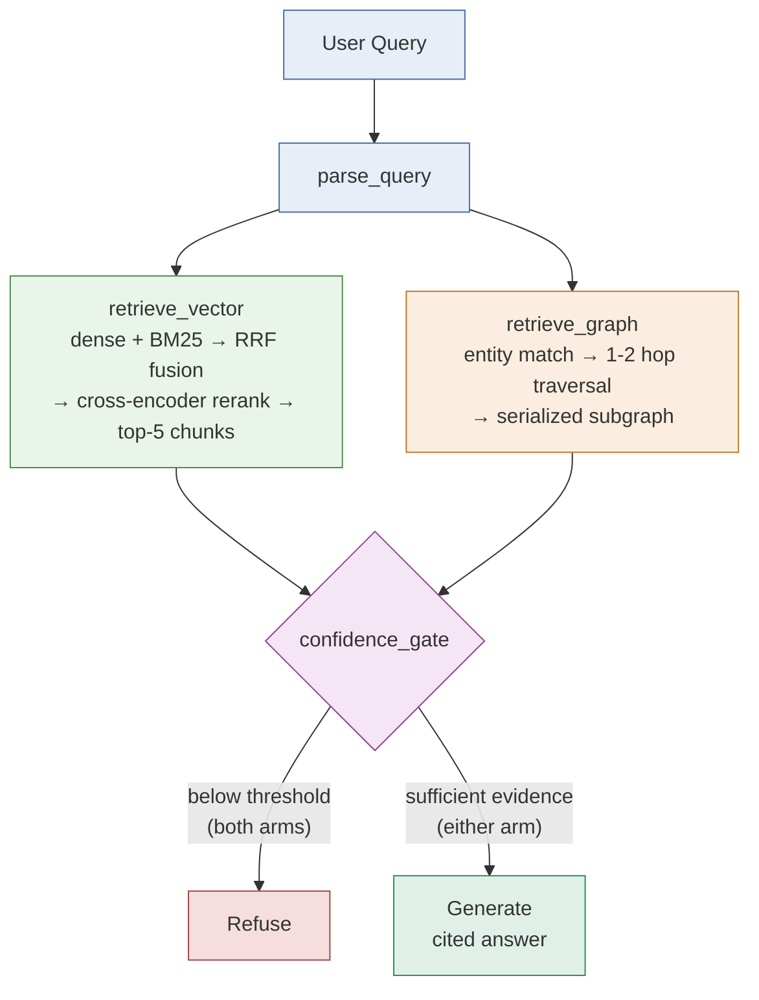

# Demo Script

A ~4-5 minute walkthrough. Each query below is picked to demonstrate one
specific, real finding from `docs/EVAL_RESULTS.md` — not a random sample.
See `docs/COMPARISON_ANALYSIS.md` for the head-to-head summary this
script is built around. Worth pulling up on screen once, briefly, before
the live queries:



## Before recording

```bash
# .env needs GITHUB_TOKEN and ANTHROPIC_API_KEY filled in
python -m app.core.ingestion   # only if data/corpus/raw/ is empty or stale
./run.sh                        # opens the Streamlit app at localhost:8501
```

Give the first query ~15-20s after page load — `st.cache_resource` builds
both indices (chunk, embed, BM25, graph) once per server process the first
time, then it's instant for every query after.

## 1. Intro (30s, talking over the loaded app)

- One-liner: "Two retrieval arms — hybrid vector search and a knowledge
  graph — run over the same corpus, the LangChain GitHub repo's PRs and
  issues, and get compared head-to-head instead of picking one and
  asserting it's better."
- Point at the "Indexed 200 PRs/issues/RFCs" caption — real data, pulled
  live via the GitHub API, not a toy fixture.

## 2. Vector arm wins — semantic/exploratory (query 4)

**Type:** `Why do shell subprocess resources leak when a run is interrupted mid-session?`

Talking point: this is a "why does X happen" design-rationale question —
exactly what dense retrieval is good at and graph traversal isn't (no
real relationship structure to walk). Watch the answer come back fully
cited (`[issue-39700-9]` etc.) and open **Retrieval details** to show the
vector arm's confidence score.

## 3. Graph arm wins — aggregation (query 3)

**Type:** `List every contributor to the agents module.`

Talking point: this is the graph arm's home turf — "list everyone
connected to X" is a traversal, not a similarity search. Show the
answer's table (PR authors, reviewers, issue-linked contributors) and the
explicit self-reported caveat at the end ("this list is limited to the
supplied subgraph") — call that out as the confidence gate and the model
both doing the right thing: answering, but not overclaiming completeness.

## 4. A real limitation, found by this eval (query 2 or 6)

**Type:** `Who reviewed the PR that resolved postponed annotations in StructuredTool, and what module does it touch?`

Talking point: this was *expected* to be a graph win (it's relational —
reviewer + module) but the graph arm actually refuses here, and vector
answers instead. Why: the graph arm's entity matcher only recognizes a
query if it literally names a PR number, username, or module — this
query *describes* the PR instead of naming it, so graph traversal never
starts. Frame this as the eval doing its job: finding a real, specific
gap (entity recognition happens before traversal, and it's currently
too literal) rather than confirming what was assumed going in.

## 5. Correct refusal (query 9)

**Type:** `Who approved LangChain's pricing model?`

Talking point: plausible-sounding, not actually in the corpus. Show both
arms refuse with the same message rather than confabulating an answer —
this is the confidence gate working as designed, checked *before*
generation ever runs.

## 6. Close (30s)

- Pull up `docs/COMPARISON_ANALYSIS.md`'s KPI table (or re-run
  `evaluation.run_comparison()` live in a terminal if you want the
  observability output on screen) — mean faithfulness ~0.99 on both arms
  when they answer, correct refusal on both refusal-test queries.
- One sentence on what's still open: the graph arm's entity matcher needs
  a query to *name* a PR/username/module rather than describe it (queries
  2 and 6), and a real entity-collapse issue (14 bot PRs merged onto one
  "unknown" node) is real but currently invisible to the eval's probe for
  it — both named explicitly in `docs/EVAL_RESULTS.md`, not hidden.
