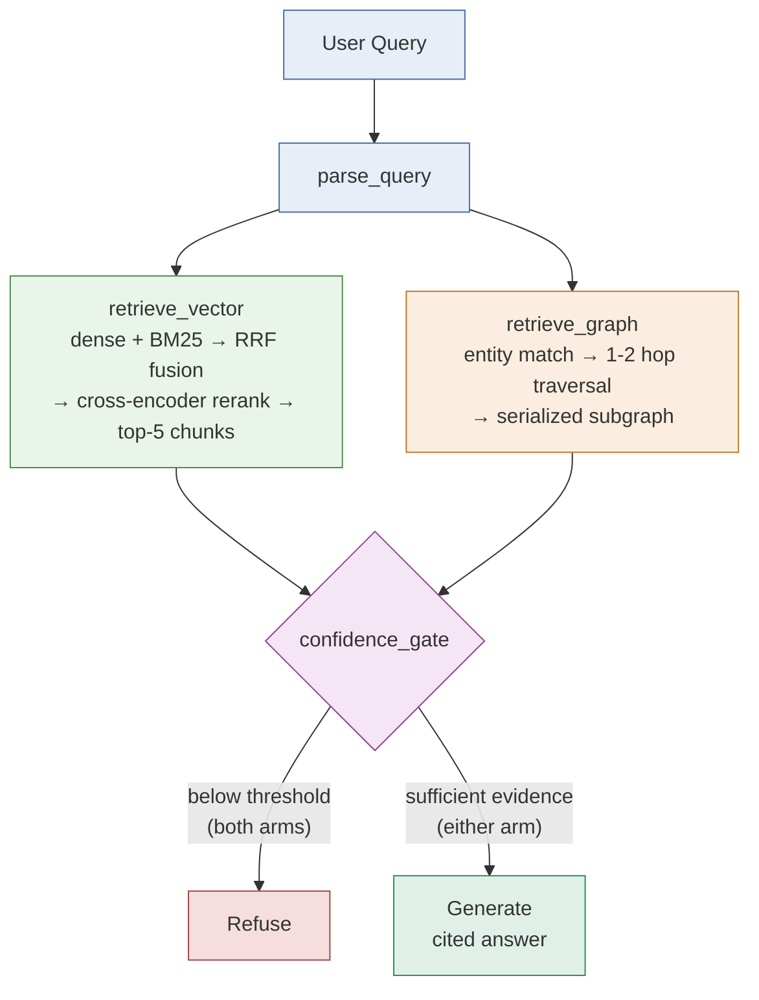

# Two Arms, One Corpus — Architecture & Eval Plan

Full interactive version (with the architecture diagram):
https://claude.ai/code/artifact/fde0d0ff-9c4e-44f2-95b2-01472a10dc98

## Architecture

Every query enters through one LangGraph state machine and is answered
twice — once by a hybrid vector retriever, once by graph traversal —
before either arm is allowed to generate:

A shared confidence gate — not the LLM — decides whether to answer or
refuse, so weak retrieval never reaches generation.

## Chunk size ↔ embedding capacity

| Embedding model | Dimensions | Recommended chunk size |
|---|---|---|
| all-MiniLM-L6-v2 (local) | 384 | 200-300 tokens |
| text-embedding-3-small (Nebius/OpenAI) | 1536 | 400-600 tokens (default) |
| text-embedding-3-large | 3072 | 600-900 tokens |

Chunk code blocks separately from prose — exact identifiers inside code
(function names, error strings) are what dense retrieval is weakest at,
which is why the vector arm is hybrid, not pure dense.

## Hybrid retrieval

- Dense retrieval: embedding similarity, catches paraphrase/semantic intent
- BM25 (sparse): term-frequency match, catches PR numbers/usernames/error
  codes/function names exactly
- Fusion + rerank: combine both result sets (reciprocal rank fusion), then
  rerank the merged top ~20 with a cross-encoder down to the top 5

## Refusal path (designed first)

The confidence gate checks both arms independently: the vector arm refuses
when the top reranked score falls below threshold; the graph arm refuses
when entity matching finds no corresponding node, or traversal returns an
empty subgraph. If both arms are below threshold, refuse outright.

> "I couldn't find this in the LangChain repo data I've indexed. Try
> rephrasing, or this may be outside what I've ingested."

## The 10-query comparison set

Grounded in the real ~200-record corpus (`data/eval/test_queries.json` —
each entry's `note` field explains what it's grounded in). An earlier
version of this table was written as generic templates before any corpus
existed; 9 of 10 turned out to have zero occurrences once real data was
pulled (see docs/EVAL_RESULTS.md for that finding). Queries 1-7 below were
rewritten against actual corpus content; 8-10 already worked as written.

| # | Query type | Example | Expected edge |
|---|---|---|---|
| 1 | Single-hop factual | Who authored PR #39832? | tie |
| 2 | Multi-hop relational | Who reviewed the PR that resolved postponed annotations in StructuredTool, and what module does it touch? | graph |
| 3 | Aggregation / list | List every contributor to the agents module. | graph |
| 4 | Semantic / exploratory | Why do shell subprocess resources leak when a run is interrupted mid-session? | vector |
| 5 | Exact-match / lexical | Which PR references `StreamClosedError`? | vector (hybrid) |
| 6 | Decision provenance | What was decided about adding standard model exception types, and who approved it? | graph |
| 7 | Ambiguous entity | What has the "unknown" contributor been working on recently? (14 unrelated bot PRs collapse onto one node — see ingestion.clean()) | stress test |
| 8 | Cross-document synthesis | Summarize the discussion across all issues tagged `streaming`. | tie |
| 9 | Out-of-corpus (refusal test) | Who approved LangChain's pricing model? | must refuse |
| 10 | Plausible but unindexed (refusal test) | What did the team decide about the Rust rewrite? | must refuse |

Queries 9-10 aren't padding: a system that scores well on 1-8 but
hallucinates on 9-10 has a broken refusal path — the more expensive failure
mode.

## Evaluation methodology

| Metric | How it's scored |
|---|---|
| Faithfulness | Does every claim trace to a retrieved chunk/edge? LLM-judge rubric + manual spot-check. |
| Relevance | Does retrieved context actually address the question. |
| Correct refusal rate | On queries 9-10: did the system refuse instead of hallucinating? |
| Latency | Wall-clock time per arm, per query. |

## Build sequence

1. Ingest and clean (GitHub API pull)
2. Build the vector index (chunk, embed, BM25, fuse, rerank)
3. Build the graph (entity/relationship extraction, 20+ nodes)
4. Wire the LangGraph state machine
5. Write and run the 10-query set
6. Score and write up the comparison
7. Package: project doc, demo video, GitHub assets

## Failure points to test for

These are where a GraphRAG pipeline actually breaks, in the order they
tend to bite. Each one is silent by default — nothing errors, the answer
is just quietly wrong — so the eval set above needs to be read with these
in mind, not just scored.

| Failure point | What goes wrong | How to test for it |
|---|---|---|
| Entity resolution | Two mentions of the same person split into separate nodes (different spellings), or two different people merged into one (same first name). Traversal from that point on is wrong. | Query 7 (the ambiguous "Alex" query) is built to surface this directly — check whether the graph arm disambiguates or silently picks one. |
| Relationship extraction | LLM-based edge extraction misses implicit relationships (a decision referenced obliquely, not stated as "X approved Y") or invents plausible-sounding ones not actually in the source. | Manually audit a random sample of extracted edges against the source PR/issue text before trusting the graph. |
| Traversal scope | Too few hops misses the answer; too many pulls in a sprawling, mostly-irrelevant subgraph that dilutes the signal or overflows context. | Sweep hop count (1 vs. 2 vs. 3) on queries 2, 3, and 6 specifically — the multi-hop and aggregation cases — and compare answer quality. |
| Subgraph → text serialization | Flattening nodes and edges into prose loses structure — which edges are causally connected vs. just co-located — so the LLM has to reconstruct relationships from an already-lossy rendering. | Print the serialized subgraph for a few queries and read it cold: could someone unfamiliar with the graph answer the query from that text alone? |
| Staleness | The graph is a one-time snapshot (see the ingestion note above) — a PR merged after ingestion simply doesn't exist in it, with no mechanism to flag the gap. | Note the ingestion timestamp in the write-up as an explicit limitation, not an afterthought. |
| Weak confidence signal | The vector arm has a clean confidence proxy (reranked similarity score); the graph arm's `matched_nodes > 0` is coarser — nodes can match but the traversal still returns junk, so the gate under-refuses. | Check the graph arm's refusal accuracy on queries 9-10 specifically against the vector arm's — a gap here means the threshold needs work, not just the graph. |
| Loses on pure semantic queries | GraphRAG tends to lose to vector-RAG on exploratory "why" questions with no real relationship structure to traverse — it does extra work to arrive at what dense retrieval gets in one hop. | Query 4 is designed to test exactly this — if the graph arm wins there too, the query set is written oddly or the graph's semantic content is unusually rich. |
