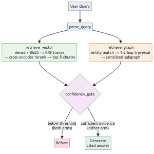

# GraphRAG for Organizational Knowledge — Project Write-up

**Project:** Two Arms, One Corpus — hybrid vector-RAG vs. GraphRAG, compared head-to-head
**Repo:** github.com/neehall/week-2-project
**Comparison results:** `docs/COMPARISON_ANALYSIS.md` (head-to-head summary) / `docs/EVAL_RESULTS.md` (full investigation log)

## 1. Project Overview

The project builds two independent retrieval "arms" — a hybrid vector-RAG
pipeline and a GraphRAG pipeline — over the same corpus, and runs both on
every query so the difference between "semantic similarity retrieval" and
"structured relationship traversal" can be measured directly, rather than
picking one architecture and asserting it's better.

**One-liner:** *My RAG app helps open-source contributors and maintainers
answer "who worked on what, and what decisions were made and by whom"
questions from the LangChain GitHub repo's contributors, PRs, issues, and
RFCs, in a simple chat interface, with grounded, cited answers.*

### Architecture



Both arms run in parallel on every query, wired through a LangGraph state
machine (`app/graph_flow.py`). A shared confidence gate — not the LLM —
decides whether to answer or refuse, so weak retrieval never reaches
generation. The refusal path was designed *before* the happy path, on the
premise that a system that hallucinates when retrieval comes up empty is
worse than one that says it doesn't know.

### Stack

| Component | Choice | Why |
|---|---|---|
| Orchestration | LangGraph | Explicit state machine, parallel fan-out/fan-in for both arms, a real branch (not a prompt instruction) for the confidence gate |
| Vector store | Chroma (local) + `rank_bm25` (sparse) | Hybrid retrieval — dense catches paraphrase/semantic intent, BM25 catches exact identifiers (PR numbers, error codes, usernames) that dense embeddings are weak on |
| Reranker | `cross-encoder/ms-marco-MiniLM-L-6-v2` | Reranks the fused top ~20 candidates down to the top 5 that reach generation |
| Embeddings | `all-MiniLM-L6-v2` (local, sentence-transformers) | No API key required; swapped in from the original Nebius-hosted plan once it became clear no Nebius key was available |
| Graph store | NetworkX (in-memory) | No server required; a Neo4j backend is scaffolded (`GraphStore(backend="neo4j")`) but not implemented — not needed for this project's scale |
| Generation | Claude (`claude-opus-5`) via the official `anthropic` SDK | Swapped in from the original Nebius-hosted LLM plan, same reason as embeddings |
| UI | Streamlit | Minimal chat interface wrapping the compiled LangGraph flow |

## 2. Dataset Used

**Source:** the public `langchain-ai/langchain` GitHub repository — PRs,
issues, and RFC-style discussions — pulled live via the GitHub REST API
(PyGithub), not a static/synthetic fixture.

**What's kept per record:** title, cleaned body, author, reviewers, linked
issue numbers, merge date, and (for PRs) the dominant module path touched
— the structured metadata the graph is built from, not just the raw text.

**Cleaning:** bot-authored comments/reviews are dropped (`[bot]`-suffixed
usernames normalized to `"unknown"`), HTML comments stripped, and fenced
code blocks are protected from prose-cleaning so identifiers inside code
aren't mangled.

**Size, pulled incrementally:**

| Pull | PRs | Issues/RFCs | Total records | Time | Rationale |
|---|---|---|---|---|---|
| 1 | 20 | 20 | 40 | 123s | Initial dev-scale pull |
| 2 | 50 | 50 | 100 | 123s | First scale-up, checked GitHub rate limit + query-term coverage |
| 3 | 100 | 100 | 200 | 251s | Final size — coverage of eval-query terms plateaued here for anything tied to fabricated specifics, confirming further scaling wouldn't help those |

At 200 records, chunking (~250-token chunks, sized for the 384-dim local
embedding model) produced ~1150-1170 chunks, and graph construction
produced 324 nodes (well past the 20-node minimum) across five node
types: contributor, PR, issue, module, and **skill** (tools/technologies
— see the graph schema note below).

**Known limitation, stated explicitly rather than glossed over:** this is
a one-time snapshot of the most-recently-updated slice of a large,
long-lived repository — not a live sync, and not comprehensive. A query
about a real but older or unrelated part of the repo's history will
correctly refuse, not because the system is broken, but because that
content was never ingested.

## 3. Prompts / Agent Instructions Used

### Generation system prompt (`app/core/generation.py`)

```
You answer questions about the langchain-ai/langchain GitHub repo using
only the context provided below — either retrieved text chunks or a
serialized graph subgraph. Every factual claim must carry an inline
citation to its source: [chunk_id] for a vector chunk (e.g.
[pr-4213-0]), or a node id for a graph fact (e.g. [contributor:alice]).
If the context doesn't support an answer, say so explicitly rather
than guessing or using outside knowledge.
```

Design intent: force per-claim citation (not just "here's a source
somewhere in the answer") and explicitly instruct the model to admit a
gap rather than fill it with outside knowledge. This was tested directly
— a query correctly retrieved the right PR but the chunk's text didn't
contain author information, and the model answered "the provided context
doesn't include author information for PR #39832" rather than guessing,
confirming the instruction holds under real retrieval gaps, not just in
the abstract.

### LLM-judge grading prompt (`app/core/evaluation.py`)

Used to score faithfulness (does every claim trace to the retrieved
context?) and relevance (does the retrieved context address the query?)
for the eval harness:

```
You are a strict grader. Respond with exactly one line:
SCORE: <a number between 0.0 and 1.0>. You may add one short
sentence of justification after that line.
```

Paired with a task-specific question appended per call, e.g.: *"Does
every factual claim in the answer trace back to the retrieved context
above? Score 1.0 if every claim is supported by the context... 0.0 if it
states facts not present in the context."*

### Refusal message (`app/common/config.py`)

```
I couldn't find this in the LangChain repo data I've indexed. Try
rephrasing, or this may be outside what I've ingested.
```

## 4. Iterations Tried

The project went through several rounds of build → test-against-real-data
→ find a real bug → fix → re-verify, rather than a single linear build.
The notable iterations:

1. **Ingestion reliability.** An early full ingestion run took 30+
   minutes. Root-caused to two compounding issues: `.env` was never
   actually loaded (`python-dotenv` was a listed dependency but
   `load_dotenv()` was never called anywhere), so the run fell back to
   GitHub's unauthenticated 60 req/hr limit; and the GitHub client had no
   request timeout, so a stalled connection just hung. Fixed both, plus
   added a wall-clock time budget independent of record limits. Verified:
   the same-shaped pull dropped from 30+ minutes to 52 seconds.

2. **Embedding/generation model swap.** The original plan specified a
   Nebius-hosted embedding and generation model. No Nebius API key was
   available. Rather than block, swapped to a local `all-MiniLM-L6-v2`
   embedding model (no key required, chunk size adjusted to match its
   384 dimensions per the plan's own capacity table) and Claude for
   generation (a GitHub-CLI-style credential wasn't available for
   Anthropic, so this required the user to generate and paste an API
   key).

3. **Vector confidence score wasn't 0-1.** The cross-encoder reranker
   returns raw logits (observed as low as -9), not a bounded similarity
   score — but the confidence gate's threshold assumed a 0-1 range.
   Fixed with a sigmoid transform; recalibrated against real in-corpus vs.
   out-of-corpus queries afterward (paraphrased in-corpus queries scored
   ~0.995-0.999, out-of-corpus queries ~0.0003-0.11 at initial testing).

4. **First 10-query eval run: 20/20 refusals.** The original 10-query
   comparison set was written as generic templates (a specific PR number,
   an invented contributor name, a fabricated error code) before any real
   corpus existed. Running it against the real data produced universal
   refusal — not a broken pipeline, but a query set that didn't describe
   anything in the actual corpus. Confirmed via direct term search before
   concluding this (9 of 10 reference terms had zero occurrences).
   Rewrote 7 of the 10 queries to be grounded in real, verified corpus
   content; kept the 2 refusal-test queries and the 1 query that already
   happened to match.

5. **A real scoring bug in the eval harness itself.** The rewritten
   queries' first full run reported mean faithfulness 0.32-0.49 despite
   manual inspection showing well-cited, clearly-grounded answers.
   Root-caused: the LLM-judge call's `max_tokens=200` didn't leave
   headroom for Claude Opus 5's default adaptive thinking, which shares
   the same token budget as the visible answer — intermittently
   truncating the response before it reached the score line and silently
   falling through to a 0.0 default. Confirmed by replaying an identical
   judge call twice and getting a thinking block once, plain text the
   other time. Fixed by raising `max_tokens` and lowering reasoning
   effort for this simple grading task; re-verified against real content
   before trusting the re-run.

6. **A truncation bug found only by actually running the UI.**
   Wiring up the Streamlit chat interface and driving it end-to-end
   (headless Chromium, not just an import check) surfaced a second real
   bug: a graph-arm aggregation answer over a larger subgraph was cut off
   mid-word. `GENERATION_MAX_TOKENS` (1024) was sized for the original
   40-record corpus and was too small once the corpus grew. This bug was
   invisible to every prior check (`refused` and the numeric scores)
   because a truncated-but-non-empty answer doesn't trip any of them —
   it only became visible by reading a real rendered answer.

7. **Deeper investigation of two "known open items."** Two limitations
   were initially written up as "the vector confidence threshold
   probably needs retuning at the larger corpus size" — a plausible but
   imprecise diagnosis. Digging one level deeper (tracing exact chunk
   scores, BM25 ranks, and fused-candidate-pool membership for the
   specific failing queries) found two more precise, different root
   causes instead:
   - A PR/issue's identifying **number was never embedded in the
     chunk's searchable text** — only carried in metadata — so a query
     naming a record by number was architecturally invisible to both
     BM25 and dense retrieval, regardless of any threshold value.
   - A correctly-retrieved, correctly-ranked-#1 passage was still
     under-scored by the cross-encoder because the passage text never
     self-identified as belonging to a PR — a reranker blind spot, not a
     retrieval failure.
   - Threshold retuning alone was checked and found mathematically
     incapable of fixing one of the two cases (the true refusal-test
     query's real score sat *between* the two problem queries' scores,
     meaning no single cutoff could separate all three correctly).
   Fixed by prepending a self-identifying `"PR #1234: title"` header to
   *every* chunk (not just the lead-in segment, which was the original,
   incomplete version of this fix) — re-verified against the exact
   failing queries and re-ran the full 10-query comparison, confirming
   the fix (vector arm went from 3/10 to 5/10 queries answered, with
   faithfulness holding steady, not dropping — 6/10 unique queries get
   an answer from at least one arm, since graph uniquely answers one
   the vector arm doesn't).

8. **A gap against the original project brief, found by re-reading the
   brief against the actual code rather than from memory.** The brief
   models org knowledge as people/projects/**skills**/documents/
   decisions. The graph schema covered four of the five — no "skill"
   node type existed. Rather than invent an arbitrary keyword scan,
   looked for a convention this specific corpus already uses reliably:
   conventional-commit title scopes (`fix(anthropic): ...`) and
   Dependabot-style "bump X from A to B" titles both name real
   tools/technologies. Added a `skill` node type and a `uses` edge
   sourced from those two patterns (the commit-scope source is
   intersected with a curated allowlist so internal module scopes like
   "core" or "infra" aren't misclassified as external tools). No new
   edge type was needed to answer "what tools did a contributor use" —
   that's the same 2-hop traversal pattern already used for
   contributor→module. Verified end-to-end against the brief's own
   example query shape ("what did X work on and what tools did they
   use") — it now answers with a dedicated, fully-cited "Tools / skills
   used" section.

9. **The skill-node fix above introduced its own regression, caught by
   re-running the full comparison rather than trusting the one query it
   was built for.** Adding `"langchain"` to the curated skill vocabulary
   (a genuine conventional-commit scope in this corpus) broke a refusal
   test: "Who approved LangChain's pricing model?" started getting
   *answered* by the graph arm instead of refused, because the product's
   own name in the question false-matched `skill:langchain` — a false
   positive that would trigger on almost any query mentioning the
   product by name, since that's the subject of the entire corpus.
   Root cause: unlike the other 11 tool names (openai, anthropic,
   deepseek, ...), "langchain" isn't a tool distinct from the repo
   itself. Fixed by removing it from the vocabulary; re-verified the
   refusal test passes again and the original tools-traversal query
   still works; re-ran the full 10-query comparison once more to confirm
   no other regression before reporting final numbers.

## 5. Learnings / Observations

- **A system that never gets run end-to-end will hide bugs that only
  exist end-to-end.** Two of the more consequential bugs in this project
  (the `.env`-never-loaded ingestion hang, and the generation truncation
  on a larger corpus) were invisible to unit-level checks and only
  surfaced by actually running the real pipeline against real data — the
  first by watching a wall-clock timer, the second by reading an actual
  rendered UI screenshot rather than trusting a `refused: False` flag.

- **A "confidence score" is often measuring the wrong thing.** The
  cross-encoder's reranked score measures topical relevance between a
  query and a passage — not whether that passage actually contains the
  fact being asked for. A query can retrieve the exactly-right document
  with high confidence and still have no answer inside it (PR title
  present, author absent) — the system's job then is to say so, not to
  either hallucinate or refuse outright. That distinction — evidence
  found vs. evidence sufficient — isn't something a single threshold can
  fully capture.

- **An initial diagnosis of "needs retuning" was too shallow, and saying
  so explicitly was the right call.** The first-pass write-up flagged a
  confidence threshold as needing recalibration. One level deeper, the
  real causes were two specific, structural bugs (a missing identifier in
  indexed text; a reranker blind spot on self-referential-less passages)
  that a threshold change could never have fixed — and the maths showed
  it explicitly (the "right" query for the true refusal test scored
  *between* the two problem queries, so no cutoff could separate all
  three). Retuning the number would have papered over the actual issue.

- **GraphRAG and vector-RAG fail differently, not just "graph wins here,
  vector wins there."** The most interesting eval result wasn't which arm
  won on which query type (though that mostly matched expectations —
  graph on aggregation, vector on semantic/exploratory) — it was the
  cases that *flipped*. Two queries expected to favor the graph arm
  instead got answered by vector, because the graph arm's entity matcher
  requires a query to literally name a PR/username/module rather than
  describe it. That's a specific, fixable gap in entity recognition, not
  a case of "the graph arm is worse."

- **An eval harness needs its own eval.** The LLM-judge scoring bug (item
  5 above) is a reminder that a scoring layer built on the same kind of
  model it's grading can inherit that model's own quirks (here: adaptive
  thinking consuming a token budget meant for the visible answer) in ways
  that produce plausible-looking but wrong numbers. The fix was caught
  only by manually reading real answers and noticing the scores
  contradicted them — automated scores were trusted only after that
  spot-check, not before.

- **Corpus/query-set mismatch is itself worth documenting, not silently
  fixing.** The first full 10-query run produced a 20/20 refusal rate.
  The honest path was to report that result plainly, explain why (a
  query set written before any corpus existed), and only then decide
  how to fix it — rather than quietly rewriting the queries first and
  presenting a "clean" result as if that had always been the plan.

- **Re-checking the original brief against the actual code — not
  against memory of what was planned — found a real gap.** The graph
  schema had quietly drifted to four node types instead of the brief's
  five somewhere between `docs/SCOPE.md`'s early scoping (a reasonable
  domain adaptation) and the final implementation, and it went
  unnoticed through several rounds of testing because every eval query
  happened to route through the four types that existed. A deliberate
  line-by-line check against the brief's literal text — not just "does
  the demo work" — is what surfaced it.
