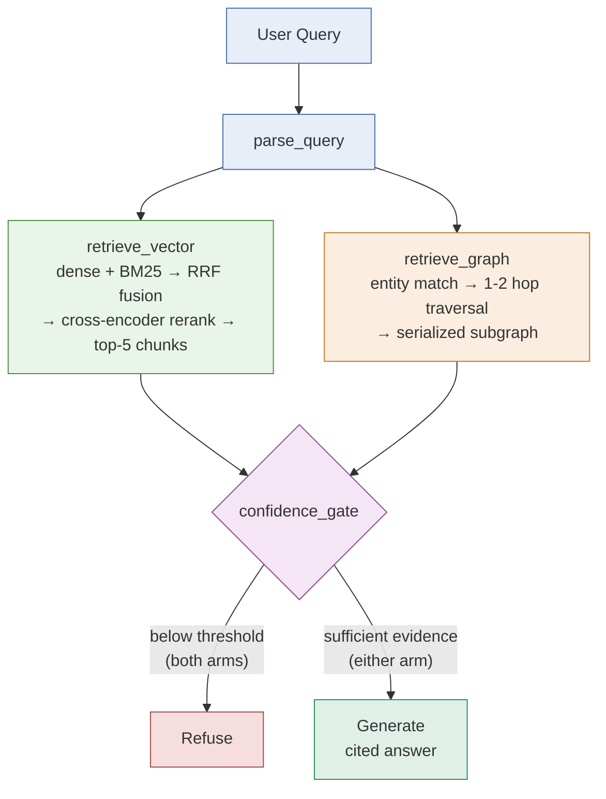

# Scope: GraphRAG for Organizational Knowledge

- Use case: Project 3 — GraphRAG for Organizational Knowledge
- Build track: Code-heavy, LangChain + LangGraph
- Corpus: `langchain-ai/langchain` GitHub repo — contributors, PRs,
  issues/RFCs, and modules, pulled via the GitHub API

## Architecture

See `docs/PLAN.md` for the full architecture writeup.

## One-liner primer

> My RAG app helps open-source contributors and maintainers answer "who
> worked on what, and what decisions were made and by whom" questions from
> the LangChain GitHub repo's contributors, PRs, issues, and RFCs, in a
> simple chat interface, with 90% faithfulness.

## Framework

| Field | Scope |
|---|---|
| Use case | Contributors/maintainers ask relationship questions like "who reviewed the memory-module refactor and what did they decide?" — via CLI or lightweight chat UI. |
| Corpus | LangChain GitHub repo: ~50-100 PRs, issues, RFC discussions, module docs via GitHub API. |
| Ingestion + cleaning | Pull via GitHub REST/GraphQL API; strip markdown boilerplate/bot comments, normalize usernames, keep PR/issue metadata (author, reviewers, linked issues, merge date). |
| Ingestion + freshness | One-time snapshot (not live-synced); no freshness SLA needed for course deliverable — noted as a limitation. |
| Chunking + embedding | PR/issue bodies chunked per-comment/section (~400-600 tokens for a 1536-dim embedding model); embed via Nebius credits. |
| Retrieve | Vector-RAG arm: dense retrieval, top-k 5, vector store (Chroma). GraphRAG arm: graph traversal (Neo4j or NetworkX) over contributor→PR→decision→module edges, seeded by entity extraction from the query. |

## Graph schema (20+ nodes required)

- Node types: contributors, PRs, issues/RFCs, modules/packages, **skills**
  (tools/technologies — provider integrations recovered from
  conventional-commit title scopes, e.g. `fix(anthropic): ...`, plus
  libraries recovered from Dependabot-style "bump X from A to B" titles;
  see `app/core/graph_build.py`'s `_extract_skills()`). Maps the original
  brief's people/projects/skills/documents/decisions framing onto this
  GitHub-repo domain — "skills" here means tools a PR/contributor touched,
  not a human skill inventory, since a code repo has no such thing
  natively.
- Edge types: authored, reviewed, merged, discusses, decided-in, **uses**
  (record → skill). A contributor's tools are a 2-hop traversal away
  (contributor -authored-> pr -uses-> skill) — no direct contributor-skill
  edge needed, same pattern as contributor-module.
